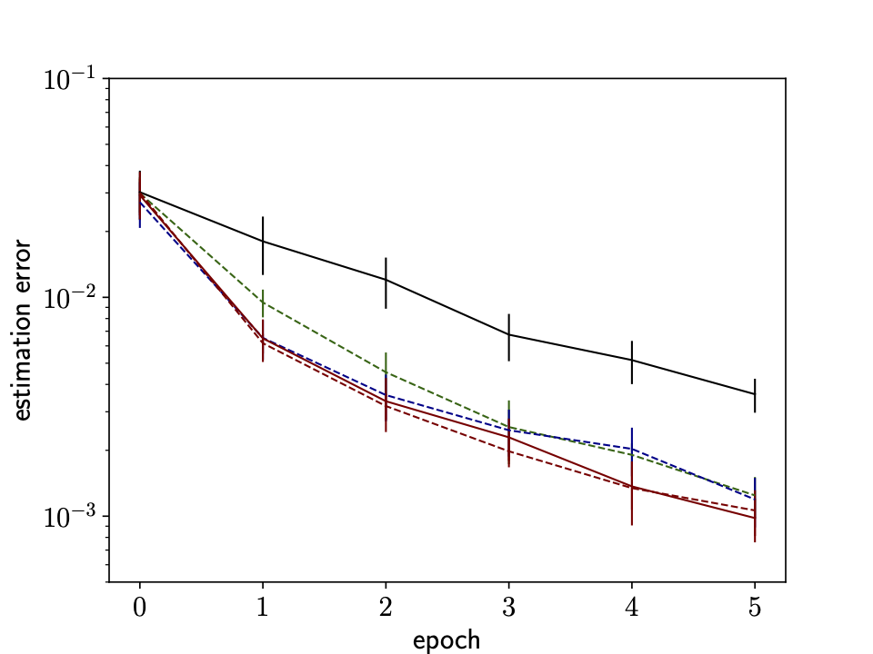
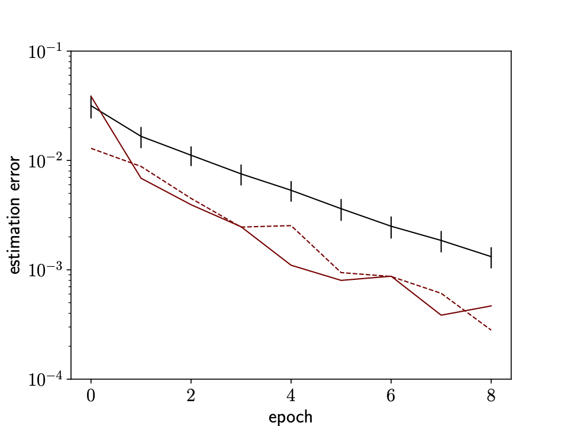
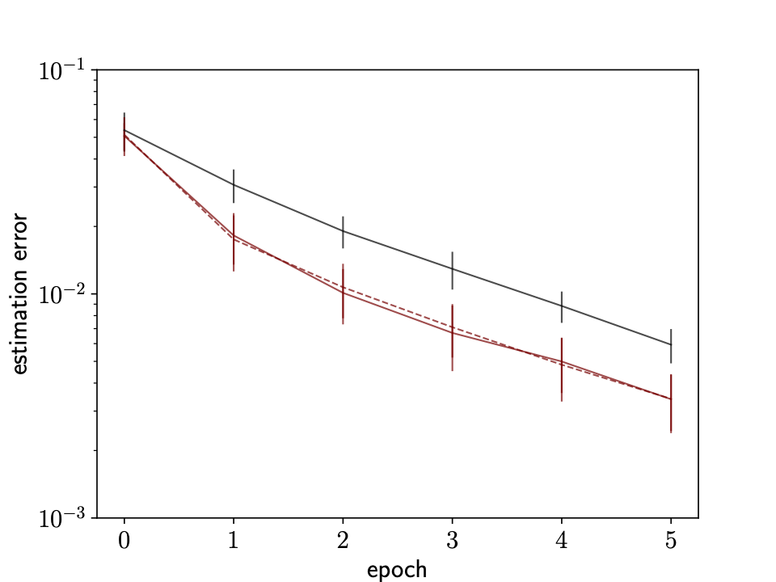

# Differentiable active learning for system identification

## Usage


### Requirements
* Python 3
* torch
* numpy
* pytorch-lightning

Install the required packages with `pip install -r requirements.txt`.


### Use our module


```python
from agents import Active

# ... 

# define a control from a neural net of input dimension d+1 and output dimension d
control = BoundedControl(
    net,                        # torch neural net module
    gamma                       # control bound
    )

 agent = agent_contructor(
     A,                         # dynamics matrix
     control,                   
     T,                         # initial time horizon
     d,
     gamma,
     sigma,                     # size of the noise
     n_epochs                   # number of training epochs per step
     )

# active learning for n_steps steps, evaluating on n_samples
estimations = agent.explore(n_steps, n_samples)
# estimations is a list of length n_steps+1 containing numpy arrays of shape (n_samples, d, d)

```

## Example
  A script comparing our differentiable programming active learning approach versus a normally-distributed baseline is provided in the file `benchmark.py`.
  We obtained the following result.

### Approximation error versus epochs





## References
Our algorithm is inspired by that of Wagenmaker *et al.* :

Andrew Wagenmaker, & Kevin Jamieson. (2020). Active Learning for Identification of Linear Dynamical Systems. 
